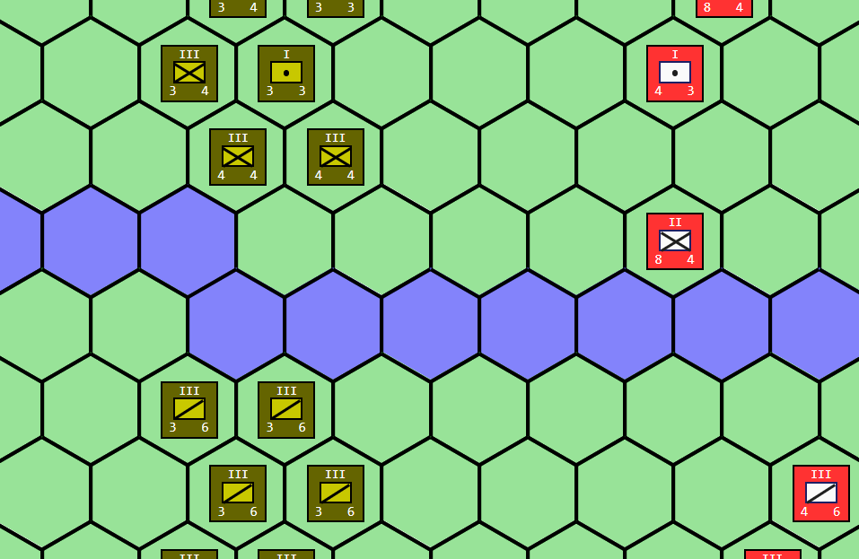

# Reinforcement Agents for Military Wargaming

Welcome to the repository for the "Reinforcement Agents for Military Wargaming" project. This project aims to combine the traditional aspects of military wargaming with the cutting-edge technology of reinforcement learning agents. We're building a simulation environment in JavaScript that allows players and AI to engage in complex military strategical and tactical scenarios.




## Table of Contents

- [Reinforcement Agents for Military Wargaming](#reinforcement-agents-for-military-wargaming)
  - [Table of Contents](#table-of-contents)
  - [Introduction](#introduction)
  - [Getting Started](#getting-started)
  - [Customized Scenario Development](#customized-scenario-development)
    - [Usage:](#usage)
    - [CSV Scenario Definition Document Structure:](#csv-scenario-definition-document-structure)
  - [Advanced Configuration](#advanced-configuration)
    - [Counter Shape](#counter-shape)
  - [Project Structure](#project-structure)
  - [Contributing](#contributing)
  - [License](#license)

## Introduction

This project is focused on creating a military wargaming environment that is both accessible and deeply configurable. Users can enjoy the simulation by simply opening the `index.html` file in their web browser.

## Getting Started

To get started, clone this repository to your local machine and navigate to the project directory. From there, you can directly open the `index.html` file in a web browser to run the wargaming environment.

```
git clone https://github.com/<your-username>/Reinforcement-Agents-for-Military-Wargaming.git
cd Reinforcement-Agents-for-Military-Wargaming
open index.html
```

## Customized Scenario Development

We provide a Python script `scenario_maker.py` that merges data from `.csv` files into a `.js` scenario file for the engine to run. This approach allows both novices and experienced wargame developers to easily create or modify game scenarios using familiar spreadsheet software like Microsoft Excel.

### Usage:

To generate a custom scenario:

```python
python scenario_maker.py scenario_dir output.js
```

### CSV Scenario Definition Document Structure:

We utilize several `.csv` files to define various aspects of the game scenario:

- **Map Configuration**
  - `block.csv`
  - `capture.csv`
  - `label.csv`
  - `terrain.csv`
  - `VP.csv`

- **Unit Setup**
  - `unit.csv` - List of units.
  - `place.csv` - Set unit locations on the map.

- **AI and Other Settings**
  - `AI.csv` - Guides the AI on how to attack.
  - `CRT.csv` - Combat Result Table.
  - `player.csv` - Player level information.
  - `setting.csv` - Miscellaneous settings.
  - `terrain_type.csv` - Attributes of terrain like movement cost and movability.

- **Other Configure Files**
  - `script.js` and `unit.css` - For triggering in-game events and setting unit counter styles, respectively.

## Advanced Configuration

### Counter Shape

The counter shape for each unit type, such as the infantry symbol in NATO Joint Military Symbology, is plotted purely through DOM manipulation in `domplot.js`. This allows for a high degree of customization and clear representation of unit types.

```javascript
     'infantry' : function(){
      var pad,line1,line2,unit;
      
      unit  = this.unitBase();
      
      pad   = unit.els.pad;
      // following code paint a cross representing infantry in NATO Joint Military Symbology
      line1 = this.brush.draw_line(0,0,26,16);
      line2 = this.brush.draw_line(0,16,26,0);
      line1.addClass('line');
      line2.addClass('line');
      line1.appendTo(pad);
      line2.appendTo(pad);
      unit.els.line=[line1,line2];
      return unit;
    },

```

## Project Structure

- `scenario_maker.py`: Script for compiling `.csv` files into scenario `.js` files.
- `csv/`: Directory containing sample `.csv` scenario files.
- `js/`: JavaScript files for the game engine and scenarios.
- `css/`: Stylesheets for units and hexes.
- `index.html`: Entry point HTML file to load and run the wargame in a web browser.

## Contributing

Contributions to the "Reinforcement Agents for Military Wargaming" project are welcome! Please read through our CONTRIBUTING.md file for guidelines on how to submit improvements, report issues, or add features.

## License

This project is released under the MIT License. Please see the [LICENSE](/License.txt) file for more details.